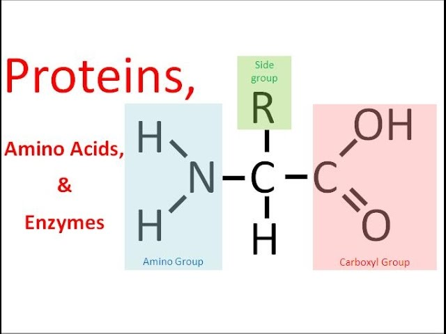

# Markdown jounal entry 3

## Protein 
protien is a polymer that is made of amino acids and joined by peptide bonds. It is one of the four macromolcules. thess include Protien, Carbohydrates, Lipids and Nucleic Acid. Carbohydrates provide short term energy. Lipids provide long term energy and insulation. Nucleic Acid stores genetic code. Protien speeds up chomical reactions. It also provides cell to cell communication, structuare for the body, transports materials that the body needs, makes up muscles and defense against pathogens. 
c=calories

$c = 2x$

monomers and polymers

| polymer  | monomer  |
| ----  | ----   |
| protien    | amino acids      |

## Pictuares

